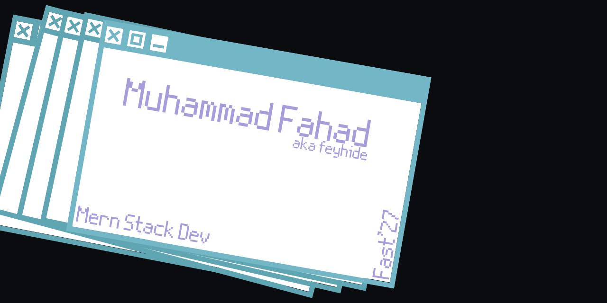

<!-- Background Image -->

  <h1>Welcome to Fahad's GitHub Profile!</h1>

  
Hi, I'm Fahad! I'm a fullstack developer with a passion for creating engaging web applications.

  <h2>Projects</h2>
  <h3>Feelhome</h3>
  
Feelhome is a real estate and hotel information site where users can create accounts to get information about places and contact the owners for further details. This project uses data from Airbnb and is not for profit.

  <ul>
    <li><strong>Frontend:</strong> Vite, GSAP, Tailwind CSS</li>
    <li><strong>Backend:</strong> MongoDB, Node.js, Express</li>
    <li><strong>Deployment:</strong> Vercel</li>
  </ul>

  <h2>Skills</h2>
  <ul>
    <li>JavaScript</li>
    <li>Node.js</li>
    <li>Express</li>
    <li>MongoDB</li>
    <li>Tailwind CSS</li>
    <li>GSAP</li>
    <li>Firebase</li>
  </ul>

  <h2>Connect with Me</h2>
  <ul>
    <li><a href="https://www.linkedin.com/in/your-profile">LinkedIn</a></li>
    <li><a href="https://twitter.com/your-profile">Twitter</a></li>
    <li><a href="https://your-portfolio.com">Portfolio</a></li>
  </ul>

  

